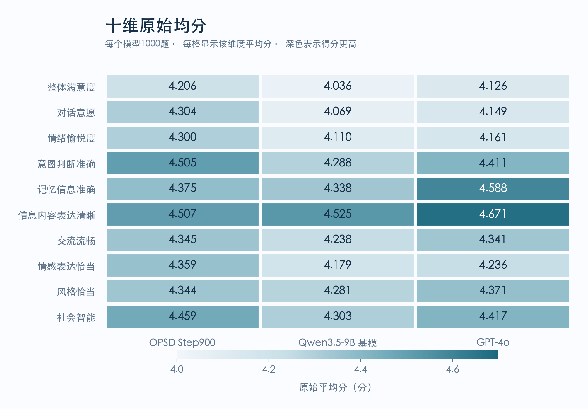

# HW Benchmark v5：1000题三模型评测

本目录包含定稿题库、三个模型的回答，以及 DeepSeek 正式十维评分。所有表格和图表均由 [summary.json](3_model_scores/summary.json) 生成；每个模型完成1000题评分。

## 数据与评测版本

- 题库：`v5_formal10d_20260921`，1000个唯一 query ID。
- 正式结果：`benchmark_v5_formal10d_20260921_formal_legacy_run2`。
- 评分协议：`project_10d_v2_unified_scene_guidance`。
- Judge：`deepseek-v4-flash-0731`；统一用于三个模型。
- 评分完成：2026-09-21 12:18:53 UTC（北京时间20:18:53）。
- 2026-09-23 分类整理：将唯一的 Career Anxiety 题并入 Emotional Intelligence；题干、记忆、回答与分数保持原样。
- 完整性报告：[integrity_report.json](3_model_scores/integrity_report.json)，`ok: true`。

本题库为第五版（v5），三个模型均在同一套1000题上测试。

题库 SHA256：

```text
2de12bdb08bc7280ba81f88b0b559154b19e5f1df264146f4d759ad414a646c4
```

## 总体表现

所有均分满分为5分，越高越好；粗体表示该列最高值。

| 模型 | 原始十维均分 ↑ | 单维＜4：该维归零 ↑ | 任一维＜4：整题归零 ↑ | 整题通过数 | 整题通过率 ↑ |
|---|---:|---:|---:|---:|---:|
| OPSD Step900 | **4.3704** | 4.1679 | 3.7554 | 825/1000 | 82.5% |
| Qwen3.5-9B 基模 | 4.2367 | 4.0051 | 3.5470 | 798/1000 | 79.8% |
| GPT-4o | 4.3471 | **4.2797** | **4.0065** | 909/1000 | **90.9%** |

### 统计口径

设第i题第d维得分为 s(i,d)，每题10维，每模型1000题：

- **原始均分**：全部10000个原始维度分数的平均值。
- **单维归零**：仅将小于4分的那个维度置0，其他维度保留；总分除以10000。
- **整题归零**：某题任意一维小于4分，该题全部10维置0；总分仍除以10000。
- **整题通过率**：十维均≥4的题数除以1000。
- **单维低分题数**：该维度得1、2或3分的题数；同一题可能出现在多个维度中，不能直接相加作为整题不通过数。

## 十维原始平均分

| 评分维度 | OPSD Step900 | Qwen3.5-9B 基模 | GPT-4o |
|---|---:|---:|---:|
| 整体满意度 | **4.206** | 4.036 | 4.126 |
| 对话意愿 | **4.304** | 4.069 | 4.149 |
| 情绪愉悦度 | **4.300** | 4.110 | 4.161 |
| 意图判断准确 | **4.505** | 4.288 | 4.411 |
| 记忆信息准确 | 4.375 | 4.338 | **4.588** |
| 信息内容表达清晰 | 4.507 | 4.525 | **4.671** |
| 交流流畅 | **4.345** | 4.238 | 4.341 |
| 情感表达恰当 | **4.359** | 4.179 | 4.236 |
| 风格恰当 | 4.344 | 4.281 | **4.371** |
| 社会智能 | **4.459** | 4.303 | 4.417 |

## 十维低分题数

每个维度的分母均为1000题，越少越好；粗体表示该行最少。

| 评分维度 | OPSD Step900 | Qwen3.5-9B 基模 | GPT-4o |
|---|---:|---:|---:|
| 整体满意度 | 93 | 111 | **34** |
| 对话意愿 | 70 | 94 | **24** |
| 情绪愉悦度 | 56 | 76 | **17** |
| 意图判断准确 | 89 | 108 | **40** |
| 记忆信息准确 | 148 | 157 | **63** |
| 信息内容表达清晰 | 35 | 44 | **6** |
| 交流流畅 | 58 | 71 | **13** |
| 情感表达恰当 | 53 | 71 | **15** |
| 风格恰当 | 55 | 64 | **11** |
| 社会智能 | 88 | 99 | **20** |
| **任一维＜4的题数（按题去重）** | 175 | 202 | **91** |



## 一级类别分布

| 一级类别 | 题数 | 占比 |
|---|---:|---:|
| Memory 记忆能力 | 353 | 35.3% |
| Emotional Intelligence 情绪智能 | 246 | 24.6% |
| Over-personalization 过度个性化控制 | 250 | 25.0% |
| Task Quality 任务质量 | 151 | 15.1% |
| **合计** | **1000** | **100%** |

题目类别与评分维度是两套概念：每道题都按同一套十维标准评分。总体结果按题平均，不按一级类别等权平均。

## 文件位置与用途

服务器目录：`/NAS/jfxiao/hw_benchmark`（可从 Song3 访问）。

```text
hw_benchmark/
├── README.md
├── 1_benchmark/
│   ├── benchmark_v5.jsonl
│   └── category_reclassification_20260923.json
├── 2_model_outputs/
│   ├── opsd_step900.jsonl
│   ├── qwen35_9b_base.jsonl
│   └── gpt4o.jsonl
└── 3_model_scores/
    ├── opsd_step900_scores.jsonl
    ├── qwen35_9b_base_scores.jsonl
    ├── gpt4o_scores.jsonl
    ├── summary.json
    ├── integrity_report.json
    ├── protocol/
    │   ├── criteria_defs.py
    │   ├── evaluate_10d.py
    │   └── evaluate_10d_base.py
    └── figures/
        ├── overall_comparison.png
        └── dimension_comparison.png
```

| 文件 | 用途 |
|---|---|
| [benchmark_v5.jsonl](1_benchmark/benchmark_v5.jsonl) | 1000题题库；主要字段包括 query_id、query、category、extracted_memories、prompt。部分来源行也保留历史 response 等字段，模型回答以2_model_outputs为准。 |
| [OPSD回答](2_model_outputs/opsd_step900.jsonl)、[基模回答](2_model_outputs/qwen35_9b_base.jsonl)、[GPT-4o回答](2_model_outputs/gpt4o.jsonl) | 每模型1000条回答，按 query_id 与题库和评分关联。 |
| [OPSD评分](3_model_scores/opsd_step900_scores.jsonl)、[基模评分](3_model_scores/qwen35_9b_base_scores.jsonl)、[GPT-4o评分](3_model_scores/gpt4o_scores.jsonl) | 每模型1000条；包含 scores、reasons、judge_raw、请求配置和来源校验字段。 |
| [summary.json](3_model_scores/summary.json) | 三种口径的总体及十维均分、低分题数、1–5分分布、通过数与通过率。 |
| [integrity_report.json](3_model_scores/integrity_report.json) | 题库、评分文件和协议代码的SHA与完整性验收记录；输入来源清单位于原运行目录 inputs/input_manifest.json。 |
| [criteria_defs.py](3_model_scores/protocol/criteria_defs.py)、[evaluate_10d.py](3_model_scores/protocol/evaluate_10d.py)、[evaluate_10d_base.py](3_model_scores/protocol/evaluate_10d_base.py) | 正式十维评分协议代码。 |

完整运行目录：`/home/jfxiao/benchmark_v5_formal10d_20260921_formal_legacy_run2`。
